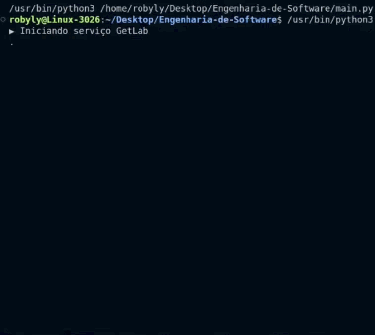
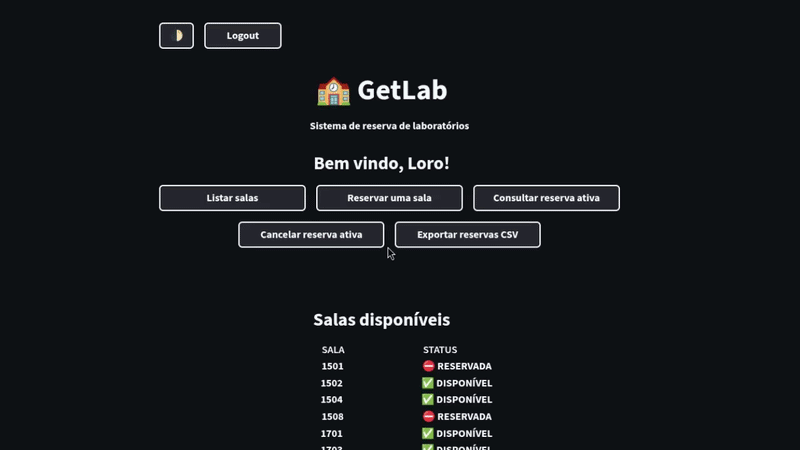
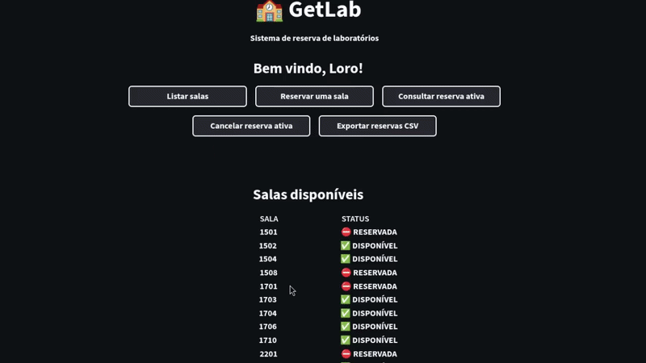

# Projeto GetLab 🏫

## ⚙️ Descrição do Problema
A FIAP fornece disponibilidade aos alunos para poderem reservar salas e laboratórios para fins de estudo e aprendizado fora do horário de aula, desde que a sala esteja disponível para reservar. Mas e se um aluno decidir reservar uma sala, ir até a pessoa responsável pela reserva de salas e descobrir de última hora que a sala que ele desejava utilizar já foi reservada por outro aluno? Com isso vem a proposta do projeto GetLab.

## 💡 Proposta
 O serviço GetLab seria uma simples aplicação integrada aos serviços de Website e Mobile da FIAP, que seria um jeito simples de fazer a reserva de laboratórios com antecedencia e sem imprevistos. Ele informaria os usuários sobre quais salas estariam disponíveis para reserva, além das salas já reservadas junto do horário e dia da tal reserva. Após o usuário escolher a reserva, o sistema atualizaria para os outros usuários quanto a reserva feita. Após feita uma reserva, o mesmo usuário não pode realizar outra até que o tenha se passado o horário reservado, ou então caso o usuário tenha cancelado com até 5 horas de antecedência.

## 🆕 Evoluções do projeto

## 🖥️ Tecnologias Necessárias
 O sistema do serviço GetLab seria interligado ao banco de dados da FIAP para assim fazer a checagem de salas disponíveis para reserva e também de salas já reservadas por outras pessoas. Para o funcionamento do protótipo, o banco de dados será simulado em um arquivo JSON com capacidade de verificação automática de integridade do arquivo de dados, criando ou corrigindo o arquivo JSON quando necessário. O sistema faria a checagem assim que o usuário acessasse o serviço, fazendo a coleta dos dados para mostrar ao usuário as salas disponíveis e salas já reservadas. Após a reserva ser confirmada, o banco de dados seria atualizado com a reserva feita pelo usuário. Para a prototipagem será utilizada de um arquivo "reservas.json" para ser utilizado como banco de dados desse sitema, assim possibilitando a simulação de coleta e armazenamento de dados.

## 🗂️ Estrutura do Projeto
```
Engenharia-De-Software/tree/Projeto-GetLab/
├── main.py
├── data.json
└── README.md
```

## 🔌 Como Executar
Para usar o protótipo, basta garantir que ambos os arquivos "main.py" e "reservas.json" estão no mesmo local do dispositivo, e então fazer a execução do arquivo "main.py" como arquivo Python, assim o terminal executará o programa e será possível interagir com ele pelo próprio terminal.

## 🪢 Funcionalidades Implementadas

- ✔ Listagem de todas as salas com indicação de status (Disponível / Reservada)
- ✔ Funcionalidade de reservar sala e armazenar nos dados
- ✔ Bloqueio de múltiplas reservas por usuário
- ✔ Bloqueio de reserva em salas já ocupadas
- ✔ Consulta da reserva ativa do usuário
- ✔ Cancelamento de reserva com confirmação do usuário
- ✔ Persistência de dados utilizando um arquivo JSON ("reservas.json")
- ✔ Tratamento de erros ou ausência do arquivo JSON
- ✔ Interface simples e prática via terminal

## ⭐ Diferencial

## 📹 Demonstração
- Inicialização do protótipo e listagem das salas

- Processo de reserva de sala e consulta de reserva

- Cancelamento de reserva e encerramento

## 📑 Documentos (Miro, repositório, vídeo)
▶️ Quadro no Miro - https://miro.com/app/board/uXjVGrmeQUI=/?share_link_id=820200413870

▶️ Caminho do repositório atual - https://github.com/AndreB2808/Engenharia-de-Software/tree/Projeto-GetLab