# 📚 Portfólio — Engenharia de Software | FIAP 2026

## Sobre este repositório
Este repositório relata e armazena a trajetória prática da disciplina de Engenharia de Software, servindo para armazenar todas as atividades e arquivos de aula em um único local acessível, assim comprovando a realização e comprometimento com cada uma.
## Como executar os exercícios
### Pré-requisitos
Todos os programas executáveis abaixo requerem qualquer versão da linguagem de programação Python, que pode ser obtida através de um instalador:

https://www.python.org/downloads/

Ou então pode ser baixado diretamente pelo terminal de comandos utilizando o seguinte comando:

```winget install -e --id Python.Python.3.14```   
### Instalação
Após a instalação do Python, qualquer um dos arquivos ".py" pode ser baixado direto deste repositório e executado em um editor de códigos (como o VS Code por exemplo (https://code.visualstudio.com/)), ou então pelo terminal utilizando a seguinte sequência de comandos (exemplo abaixo considerando que o arquivo baixado esteja localizado no Desktop):

```
cd desktop 
python NOMEDOARQUIVOAQUI.py
python ConverteTemp.py
```  

## Exercícios por Aula
### Aula 02 — Levantamento de Requisitos
### ⌨️ Código
Arquivo: [`ConverteTemp.py`](02-Requisitos/ConverteTemp.py)

Esse simples código possui apenas a funcionalidade de converter uma temperatura fornecida em Celsius ou Fahrenheit pelo usuário, e converter essa temepratura para a medida oposta, podendo repetir o processe quantas vezes desejar. 

### ⏯️ Execução
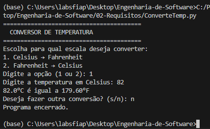

Ao iniciar, o código solicita a escolha da conversão desejada pelo usuário. Caso a escolha seja inválida o programa solicita novamente a escolha até que seja selecionada uma opção válida. Após isso o usuário insere o valor a ser convertido para a medida oposta e logo após o programa mostra a conversão, perguntando se o usuário deseja repetir o processo, assim reiniciando o programa até que o usuário deseje parar o processo.

### Aula 03 — Requisitos Funcionais vs. Não-Funcionais
### ⌨️ Código
Arquivo: [`Gymtrack.py`](03-RFvsRNF/Gymtrack.py)

Esse programa possui apenas o propósito de fazer testes em relação a requisitos funcionais e requisitos não-funcionais. O usuário não fornece nenhum input ao inicializar o programa, já que o código utiliza os dados de exemplo presentes nele mesmo para mostrar o resultado da simulação.

### ⏯️ Execução
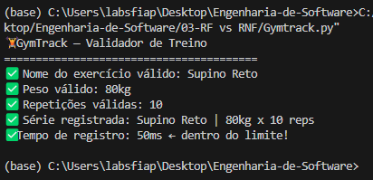

Primeiramente o código valida se o nome do exercício não está vazio, mostrando que o nome do exercício é inválido caso esteja. Depois o código analisa o peso fornecido, validando se está entre 1 kg e 300 kg. Por fim, ele valida o número de repetições fornecida para checar se está entre 1 e 50 repetições. Após fazer as validações, o código faz uma simples simulação de tempo de execução do programa, validando se o processo de registro durou menos de 200 ms para ser executado.

### Aula 04 — Documento SRS
### ⌨️ Código
Arquivo: [`SRS.py`](04-SRS/SRS.py)

O seguinte código faz a simulação de um sistema simples de SRS (Software Requirements Specification), permitindo cadastrar e organizar requisitos funcionais e não-funcionais de um projeto. Além disso, ele realiza validações automáticas em requisitos funcionais e gera um relatório estruturado contendo informações, prioridades e critérios de aceitação do sistema.

### ⏯️ Execução
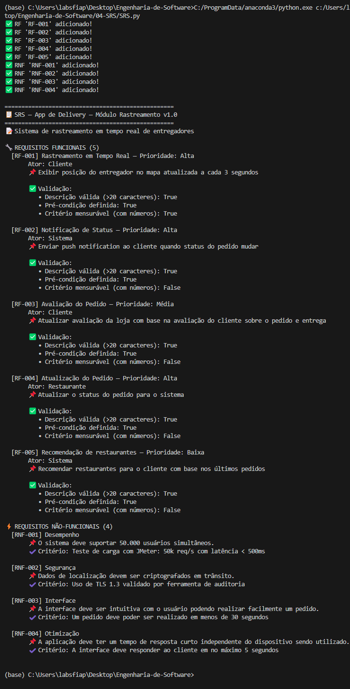

Durante a execução do código, o programa adiciona requisitos funcionais e não-funcionais relacionados ao rastreamento de pedidos. Em seguida, o programa valida automaticamente alguns critérios dos requisitos e exibe um relatório completo formatado no terminal.

### Aula 05 — UML e Casos de Uso
### 📔 Diagrama
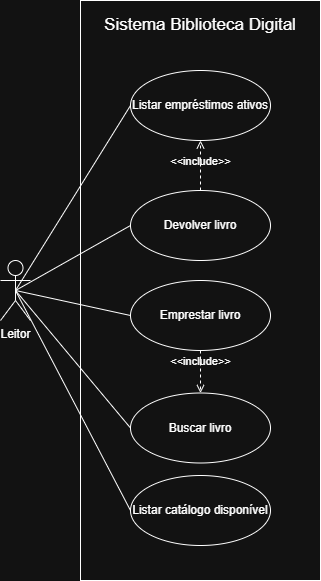

Esse diagrama de casos de uso demonstra de forma visual as principais funcionalidades do código apresentado, facilitando a compreensão da estrutura e do funcionamento do sistema, além de servir como uma forma de organização e planejamento para o desenvolvimento do programa em si.

### ⌨️ Código
Arquivo: [`BibliotecaDigital.py`](05-CasosDeUso/BibliotecaDigital.py)

O código simula um sistema simples de biblioteca digital, permitindo cadastro de livros, busca por títulos, realização de empréstimos e devoluções, além de controlar a disponibilidade dos livros e listar os empréstimos ativos no sistema.

### ⏯️ Execução
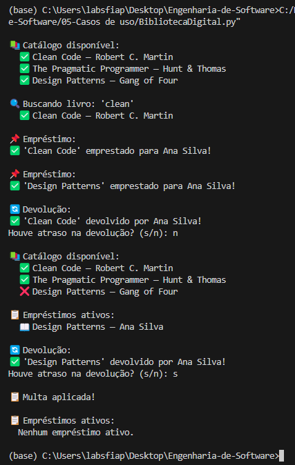

Primeiramente é feito o cadastro de 3 livros de exemplo. Depois é executada a função que exibe todos os livros que foram cadastrados no catálogo, e então é executada a função de buscar um livro específico do catálogo. Após isso é simulada a função de empréstimo para uma pessoa fictícia, e então é feita a devolução de um dos livros, onde o usuário informa se houve atraso ou não, aplicando uma multa caso infromado que sim. Por fim o processo de listar catálogo e devolução são repetidos com o listamento de empréstimos no fim.

### Aula 06 — Diagramas de Atividades
### 📔 Diagrama
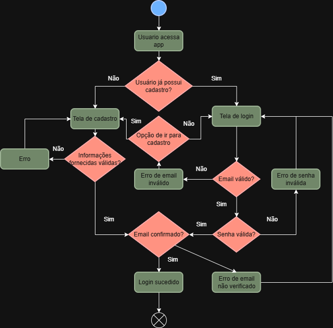

O diagrama de atividades mostrado representa um sistema simples de cadastro e login de uma aplicação, iniciando com a escolha do usuário de cadastrar ou realizar login, e então o fluxo do diagrama segue dependendo das escolhas do usuário, indo desde o processo inicial de inserir email até o processo de validar a verificação do email.

### ⌨️ Código
Arquivo: [`FluxoDiagrama.py`](06-Atividades/FluxoDiagrama.py)

O código toma como base apenas os conceitos de cadastro e login do diagrama utilizando informações já fornecidas dentro do código, portanto não há input do usuário diretamente no terminal. O código apenas faz a validação de alguns fatores como "O email já está registrado em outra conta?" ou "A senha fornecida se encaixa nos requisitos?" por exemplo, assim retornando "SUCESSO" ou "ERRO" em relação ao login dependendo dos resultados.

### ⏯️ Execução
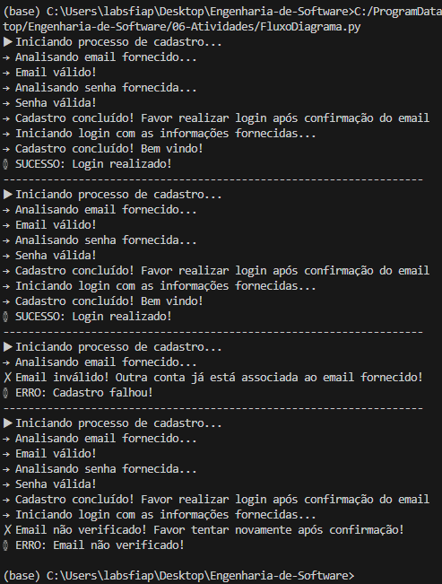

O código utiliza 4 exemplos de cadastro com dados fictícios para a simulação. Em cada processo, inicia-se com a validação do email fornecido, depois verificando se a senha atende os requisitos, e por fim é feita a tentativa de login que pode apenas ser realizado caso o email tenha sido verificado, retornando "SUCESSO" caso o login tenha sido efetuado, ou "ERRO" mostrando o porque falhou.

### Aula 07 — Diagramas de Sequência
### 📔 Diagrama
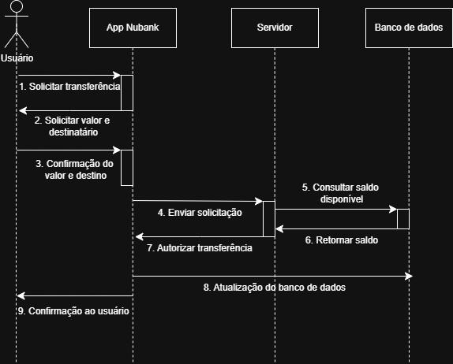

Esse diagrama de sequência mostra um exemplo de ação realizada no App Nubank, simulando a comunicação entre camadas quando o usuário deseja realizar uma transferência de dinheiro. Nesse cenário ocorre a participação do usuário, do App Nubank, do servidor do Nubank e do banco de dados do Nubank.

### ⌨️ Código
Arquivo: [`NubankExemplo.py`](07-Sequência/NubankExemplo.py)

O programa faz a simulação da transferência por meio de classes que representam os participantes desta ação, além do programa ter a capacidade de identificar quando uma transferência é aprovada ou recusada dependendo do valor disponível para saque, com o sistema recebendo a resposta do banco de dados e mostrando ao usuário.

### ⏯️ Execução
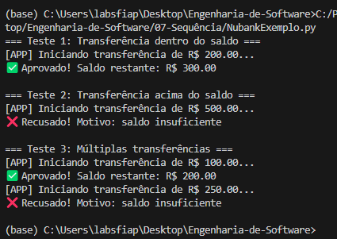

São realizados 3 testes de transferência para um usuário com saldo inicial de 500 reais. Na primeira transferência de 200 reais o programa aprova a solicitação, mas logo na segunda é recusado por solicitar um valor acima do disponível, e no fim são feitas duas transferências simultâneas com uma sendo aprovada por estar dentro do limite enquanto a segunda é recusada.

### Aula 08 — Diagramas de Classes
### 📔 Diagrama
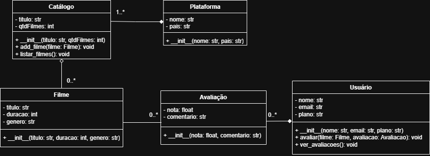

O diagrama de classes seguinte representa a estrutura principal de um sistema de Streaming, mostrando as classes responsáveis pela plataforma, catálogo, filmes, usuários e avaliações. Além disso, ele demonstra os relacionamentos entre os elementos do sistema, facilitando a compreensão da organização e funcionamento do programa.

### ⌨️ Código
Arquivo: [`Netplix.py`](08-Classes/Netplix.py)

Cada uma das classes no código representa uma das classes do diagrama anterior, assim os testes realizados envolvem a utilização delas em contextos como listar filmes disponíveis, avaliar filmes, ou ver avaliações por exemplo.

### ⏯️ Execução
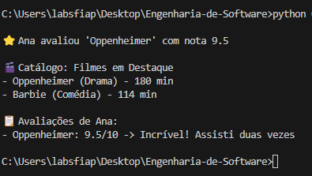

O código não exibe todas as ações realizadas no terminal, porém o sistema registra as ações realizadas após a definição de cada classe. Primeiro é definido o nome e localidade da plataforma, depois o nome do catálogo no qual serão adicionados filmes, então são adicionados dois filmes de exemplo, e então o catálogo é registrado na plataforma criada. Após isso é criado um usuário fictício e esse usuário avalia um dos filmes com uma nota de 0 a 10 junto de um comentário, e então o sistema registra a avaliação e por fim faz a listagem dos filmes disponíveis e das avaliações disponíveis de cada filme. 

### Aula 09 — Arquitetura MVC
### 📔 Diagrama
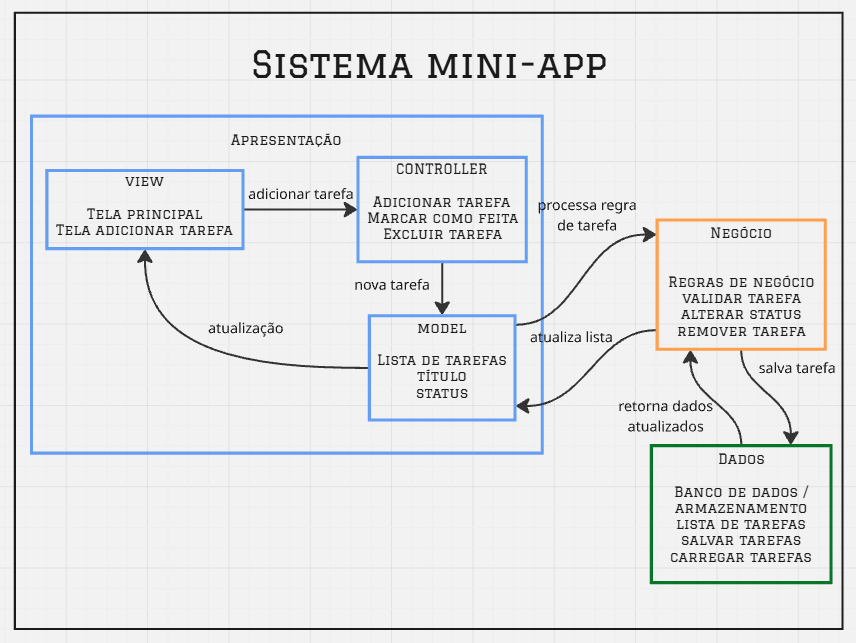

Neste diagrama MVC é representada a organização do sistema de lista de tarefas utilizando a arquitetura em camadas e o padrão MVC (Model-View-Controller). Ele mostra como a interface, as regras de negócio e os dados se comunicam, facilitando a visualização do fluxo de ações e da estrutura geral da aplicação.

### 🖥️ Protótipo Figma
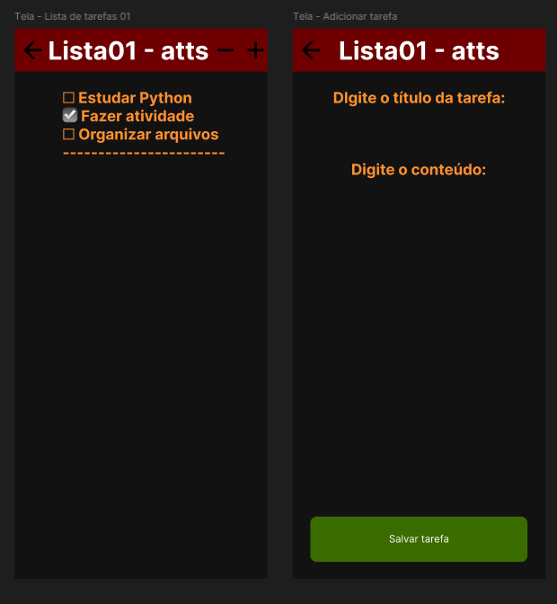

A seguinte prototipação desenvolvida no Figma representa visualmente a interface de um aplicativo simples de lista de tarefas para dispositivos móveis. Ele demonstra a organização das telas de uma lista de exemplo e da criação de tarefas.

### 🔗 Link do repositório atual: https://github.com/AndreB2808/Engenharia-de-Software/tree/main
