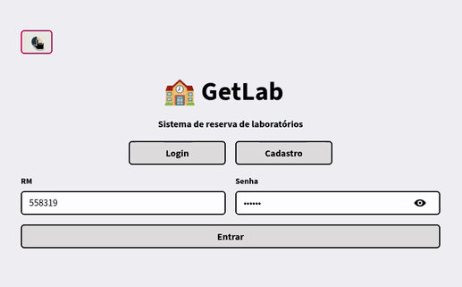
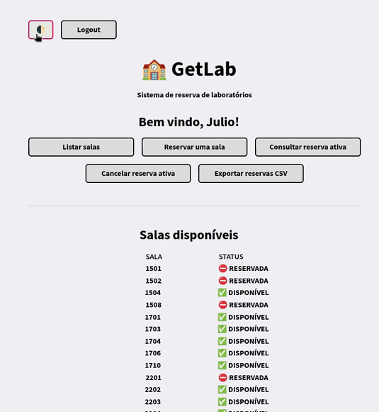

# Projeto GetLab 🏫

## ⚙️ Descrição do Problema
A FIAP fornece disponibilidade aos alunos para poderem reservar salas e laboratórios para fins de estudo e aprendizado fora do horário de aula, desde que a sala esteja disponível para reservar. Mas e se um aluno decidir reservar uma sala, ir até a pessoa responsável pela reserva de salas e descobrir de última hora que a sala que ele desejava utilizar já foi reservada por outro aluno? Com isso vem a proposta do projeto GetLab.

## 💡 Proposta
 O serviço GetLab seria uma simples aplicação integrada aos serviços de Website e Mobile da FIAP, que seria um jeito simples de fazer a reserva de laboratórios com antecedência e sem imprevistos. Ele informaria os usuários sobre quais salas estariam disponíveis para reserva, além das salas já reservadas junto do horário e dia da tal reserva. Após o usuário escolher a reserva, o sistema atualizaria para os outros usuários quanto a reserva feita. Após feita uma reserva, o mesmo usuário não pode realizar outra até que o tenha se passado o horário reservado, ou então caso o usuário tenha cancelado com até 5 horas de antecedência. Os usuários acessariam o sistema por meio do cadastro utilizando um RM de uma matrícula válida, sendo obrigatória para a utilização do serviço como forma de comprovação que é um aluno quem está utilizando do mesmo.

## 🆕 Evoluções do projeto
 O projeto recebeu uma atualização significativa em relação a versão anterior, contando agora com cadastro e login de usuários, interface visual funcional em Streamlit (com opção de tema Light/Dark), organização em módulos ("auth", "models" e "views") e exportação de dados para formato csv.

## 🖥️ Tecnologias Necessárias
 O sistema do serviço GetLab seria interligado ao banco de dados da FIAP para assim fazer a checagem de salas disponíveis para reserva e também de salas já reservadas por outras pessoas. Para o funcionamento do protótipo, o banco de dados será simulado em um arquivo JSON com capacidade de verificação automática de integridade do arquivo de dados, criando ou corrigindo o arquivo JSON quando necessário. O sistema realiza a checagem assim que o usuário acessa o serviço, coletando os dados dos outros arquivos presentes para mostrar as salas disponíveis e já reservadas. Após a reserva ser confirmada, o banco de dados é atualizado com a nova informação. Na versão atual, o protótipo utiliza "usuarios.json" e "reservas.json" para simular a coleta e o armazenamento de dados, além de utilizar o Streamlit para a interface visual e o módulo "csv" para exportação das reservas.

## 🗂️ Estrutura do Projeto
```
    Engenharia-De-Software/tree/Projeto-GetLab/
    ├── src/
    │   ├── auth/
    │   │   ├── cadastro.py
    │   │   └── login.py
    │   ├── data/
    │   │   ├── usuarios.json
    │   │   └── reservas.json
    │   ├── models/
    │   │   └── reserva_model.py
    │   ├── views/
    │   │   └── interface_view.py
    │   ├── main.py     
    ├── README.md
    └── requirements.txt
```

## 🔌 Como Executar
### Pré-requisitos
    - Python 3
    - Steamlit (caso esteja no Linux é necessário instalar dentro de uma venv) 
 Primeiramente é necessário baixar todos os arquivos do projeto. Após a instalação, e dentro de um programa como Visual Studio Code, abra a pasta principal que contêm todos os arquivos. Depois, abra um terminal novo e digite "pip install -r requirements.txt" para instalar as dependências requisitadas (neste caso sendo apenas o "Streamlit"), e então execute o projeto utilizando o comando "streamlit run src/app.py", que abrirá uma guia no navegador da aplicação, sendo possível cadastrar um usuário, fazer login e utilizar as funcionalidades do sistema diretamente pela interface visual.

## 🪢 Funcionalidades Implementadas

- ✔ Cadastro de usuários com RM e senha
- ✔ Login de usuários cadastrados
- ✔ Listagem de todas as salas com indicação de status (Disponível / Reservada)
- ✔ Funcionalidade de reservar sala e armazenar nos dados
- ✔ Bloqueio de múltiplas reservas por usuário
- ✔ Bloqueio de reserva em salas já ocupadas
- ✔ Consulta da reserva ativa do usuário
- ✔ Cancelamento de reserva com confirmação do usuário
- ✔ Persistência de dados utilizando um arquivo JSON ("usuarios.json" e "reservas.json")
- ✔ Tratamento de erros ou ausência do arquivo JSON
- ✔ Interface prática via Streamlit
- ✔ Alternância entre tema Light/Dark
- ✔ Exportação para formato csv das reservas ativas
- ✕ Validação de antecedência para cancelamento de reserva
- ✕ Validação de RM com base no banco de dados da FIAP
- ✕ Criptografia dos dados cadastrados

## ⭐ Diferencial
 1. Tema Light/Dark
 Foi escolhida a implementação de uma opção de escolher entre tema claro e escuro para a interface, justamente pela implementação da interface básica. A alternância de tema melhora a experiência do usuário, principalmente em diferentes condições de iluminação, reduzindo fadiga visual além de vários usuário optarem pela utilização de apenas um dos temas, e tornando o sistema mais acessível, 
 
 2. Exportação de reservas para .csv 
 Além da mudança de tema, como bônus, há uma opção de baixar em formato csv a lista atual de reservas. A exportação em csv permite que os dados não fiquem restritos apenas na aplicação, com usuários podendo organizar, compartilhar ou analisar informações de reservas da forma que acharem mais apropriado.

## 📹 Demonstração
- Exemplo de cadastro e login

- Processo de reserva de sala

- Cancelamento de reserva

- Demonstração do tema Light/Dark



## 📑 Documentos (Miro, repositório, vídeo)
▶️ Quadro no Miro - https://miro.com/app/board/uXjVGrmeQUI=/?share_link_id=820200413870

▶️ Caminho do repositório atual - https://github.com/AndreB2808/Engenharia-de-Software/tree/Projeto-GetLab